<div align="center">


<h3>ИИ пишет код быстро. AigisSAST проверяет, что он не оставил дыр.</h3>

<p><i>Security scanner for AI-generated code: finds what vibe coding leaves behind and explains how to fix it.</i></p>

<a href="https://github.com/jasperBLCK/AigisSAST/actions/workflows/ci.yml"></a>    

</div>


<div align="center">
  
</div>

## Зачем

Cursor, Copilot и ChatGPT собирают рабочий бэкенд за вечер. Но по пути они почти всегда оставляют одно и то же:
токен бота прямо в коде, `f"SELECT ... {user}"`, `allow_origins=["*"]`, `debug=True`, открытый наружу Postgres.
Код работает, тесты зелёные, а сервис уже можно взломать.

AigisSAST ловит именно эти ошибки и объясняет каждую **простым языком**: чем она опасна и как исправить, с готовым кодом.
Без регистрации и облака, ничего не отправляет наружу (если сам не включишь `--ai`).

- **Ноль зависимостей.** Только стандартная библиотека Python, ставится за секунду.
- **AST, а не grep.** Python-код разбирается синтаксическим деревом, поэтому меньше ложных срабатываний.
- **Секреты маскируются** в отчёте: `sk-p************`, сам ключ в логах CI не светится.
- **CI-ready.** Exit-коды, SARIF для GitHub Code Scanning, JSON, Markdown, GitHub Action и pre-commit hook.

## Быстрый старт

```bash
pip install git+https://github.com/jasperBLCK/AigisSAST
aigis scan .
```

Попробуй на заведомо дырявом примере:

```bash
git clone https://github.com/jasperBLCK/AigisSAST && cd AigisSAST
pip install . && aigis scan examples
```

## Что ловит

| ID | Уровень | Проблема | Где |
|---|---|---|---|
| `AIG001` | CRITICAL | Токены и API-ключи: OpenAI, Anthropic, Telegram, GitHub, AWS, Stripe, Slack, Google, Yandex Cloud | везде |
| `AIG004` | CRITICAL | Приватные ключи (RSA / EC / OpenSSH / PGP) | везде |
| `AIG002` | HIGH | Захардкоженные пароли и секреты | Python, JS/TS, YAML, Dockerfile, compose, .ini/.toml |
| `AIG003` | HIGH | Строка подключения к БД с паролем | везде, кроме документации |
| `AIG005` | HIGH | `.env` попадает в репозиторий | git / .gitignore |
| `AIG010` | HIGH | SQL-инъекция: f-string, `%`, `+`, `.format()` в `execute()` / `text()` | Python |
| `AIG011` | HIGH | Shell-инъекция: `shell=True`, `os.system` с переменной | Python |
| `AIG012` | HIGH | `eval` / `exec` над динамическими данными | Python |
| `AIG013` | HIGH | `pickle.loads`, `yaml.load` без SafeLoader | Python |
| `AIG017` | HIGH | JWT без проверки подписи, `algorithms=["none"]` | Python |
| `AIG030` | HIGH | `eval` / `new Function` | JS / TS |
| `AIG014` | MEDIUM | `debug=True`, `DEBUG = True` | Python |
| `AIG015` | MEDIUM → HIGH | CORS `*` (HIGH вместе с `allow_credentials=True`) | FastAPI, Express |
| `AIG016` | MEDIUM | `verify=False` в requests / httpx | Python |
| `AIG019` | MEDIUM | Токены и OTP-коды через `random` вместо `secrets` | Python |
| `AIG031` | MEDIUM | XSS: `innerHTML`, `dangerouslySetInnerHTML`, `v-html` | JS / TS / Vue |
| `AIG032` | MEDIUM | Секреты в `NEXT_PUBLIC_*` / `VITE_*` / `REACT_APP_*` | фронтенд |
| `AIG042` | MEDIUM | Порт БД/Redis опубликован на `0.0.0.0` | docker-compose |
| `AIG018` | LOW | MD5 / SHA-1 | Python |
| `AIG021` | LOW | POST/PUT/PATCH/DELETE без `Depends(...)` авторизации | FastAPI |
| `AIG040` | LOW | Контейнер работает от root | Dockerfile |

Подробно про любое правило: `aigis explain AIG010`, полный список: `aigis rules`.

## Использование

```bash
aigis scan .                              # текстовый отчёт с объяснениями
aigis scan src api --quiet                # несколько путей, без блоков «чем опасно / как исправить»
aigis scan . --min-severity medium        # скрыть LOW
aigis scan . --fail-on critical           # падать только на критичных
aigis scan . -f sarif -o aigis.sarif      # для GitHub Code Scanning
aigis scan . -f json | jq '.findings[]'   # для своих скриптов
aigis scan . -f markdown > SECURITY.md    # отчёт для PR / заказчика
```

| Exit code | Значение |
|---|---|
| `0` | нет находок уровня `--fail-on` (по умолчанию `high`) и выше |
| `1` | найдены проблемы уровня `--fail-on` и выше |
| `2` | ошибка запуска (неверный путь, неизвестное правило) |

В конце отчёта выводится **security score** (0–100) и оценка от `A` до `F`.

### Исключения

```python
eval(trusted_expr)  # aigis: ignore
DEBUG = True  # aigis: ignore[AIG014]
```

Файлы и папки исключаются через `.aigisignore` (glob-шаблоны) или флаг `--exclude`.
`node_modules`, `.venv`, `dist` и lock-файлы пропускаются автоматически, а в git-репозитории ещё и всё из `.gitignore`.

## AI-режим

```bash
export AIGIS_API_KEY=...                         # любой OpenAI-совместимый API
export AIGIS_BASE_URL=https://api.openai.com/v1  # или свой прокси / локальная LLM
export AIGIS_MODEL=gpt-4o-mini
aigis scan . --ai
```

Для каждой находки модель получает фрагмент кода вокруг неё и возвращает исправление именно под твой код.
**Находки с секретами (`AIG001`–`AIG005`) в модель никогда не отправляются.** Если ключа нет или API недоступен,
сканер предупредит об этом и покажет стандартные советы.

## GitHub Actions

```yaml
name: security
on: [push, pull_request]

jobs:
  aigis:
    runs-on: ubuntu-latest
    permissions:
      contents: read
      security-events: write
    steps:
      - uses: actions/checkout@v4
      - uses: jasperBLCK/AigisSAST@v0.1.0
        with:
          fail-on: high
```

Находки появятся во вкладке **Security → Code scanning** и прямо в diff пулл-реквеста.

## pre-commit

```yaml
repos:
  - repo: https://github.com/jasperBLCK/AigisSAST
    rev: v0.1.0
    hooks:
      - id: aigis
```

## Как устроено

```text
aigis scan
   │
   ├── scanner      git ls-files → фильтры → .aigisignore → чтение файлов
   ├── checks/
   │    ├── python_ast   ast.NodeVisitor: SQL, shell, eval, pickle, JWT, CORS, debug, random, FastAPI auth
   │    └── text         regex: токены, ключи, DSN, конфиги, Dockerfile, compose, JS/TS
   ├── ai           (опционально) OpenAI-совместимый API, секреты отфильтрованы
   └── report       text · json · sarif · markdown  +  score / grade
```

Разработка:

```bash
python -m venv .venv && . .venv/bin/activate
pip install -e ".[dev]"
ruff check . && ruff format --check . && pytest -q
```

## Roadmap

- [x] Python AST-правила, секреты, конфиги, Dockerfile, compose, JS/TS
- [x] SARIF, JSON, Markdown, GitHub Action, pre-commit
- [x] AI-исправления через OpenAI-совместимый API
- [ ] `aigis fix`: автоматическое исправление безопасных случаев (вынос секретов в `.env`)
- [ ] Проверка зависимостей на известные CVE и тайпсквоттинг
- [ ] Правила для Django и Flask, Go и PHP
- [ ] VS Code extension

## License

[MIT](LICENSE)


<div align="center"><sub>built by <a href="https://github.com/jasperBLCK">jasperBLCK</a> · ship fast, ship secure</sub></div>
